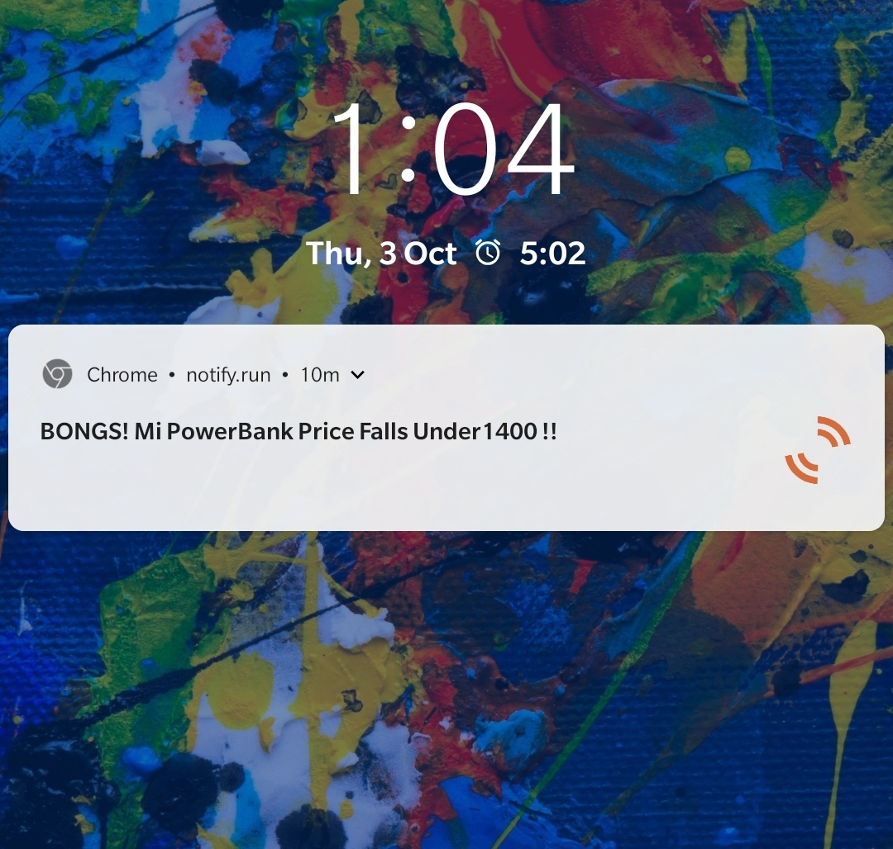
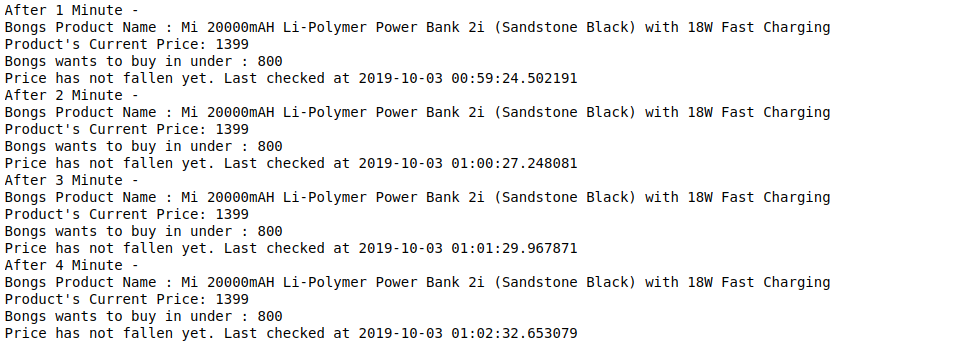

# Amazon-Floatify :

Great-India-Sale-InfoScrapper Cum Notifier

Python script, written so that when a desired product hits a lower price than a desired price, then we'll get a push notification! so that the deal cannot be missed.

CASE 1 - When a Desired Product hits a lower price than expected price.Then we'll get a Push Notification like this :

And This -

CASE 2- When Prices have not fallen yet :

